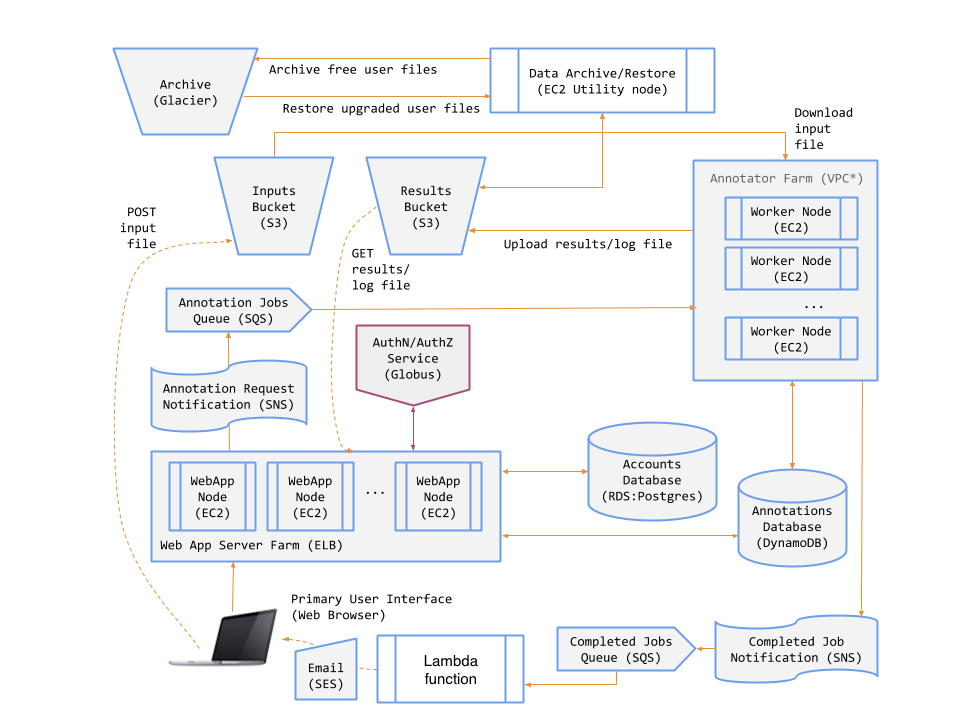

# Genomics Analysis Online Service

Genomics Analysis Online Service is a functional software-as-a-service for genomics annotation for Genome Annotation and Analysis. Users can upload their files, request an annotation and get their result.

## Key Functions

1. Log in (via Globus Auth) to use the service -- Some aspects of the service are available only to registered users. Two classes of users will be supported: Free and Premium. Premium users will have access to additional functionality, beyond that available to Free users.

2. Upgrade from a Free to a Premium user -- Premium users will be required to provide a credit card for payment of the service subscription. 
3. Submit an annotation job -- Free users may only submit jobs of up to a certain size. Premium users may submit any size job. If a Free user submits an oversized job, the system will refuse it and will prompt the user to convert to a Premium user.
4. Receive notifications when annotation jobs finish -- When their annotation request is complete, the GAS will send users an email that includes a link where they can view the log file and download the results file.
5. Browse jobs and download annotation results -- The GAS will store annotation results for later retrieval. Users may view a list of their jobs (completed and running). Free users may download results up to 10 minutes after their job has completed; thereafter their results will be archived and only available to them if they convert to a Premium user. Premium users will always have all their data available for download.

## System Components 
An object store for input files, annotated (result) files, and job log files.
+ A key-value store for persisting information on annotation jobs.
+ A low cost, highly-durable object store for archiving the data of Free users.
+ A relational database for user account information.
+ A service that runs AnnTools for annotation.
+ A web application for users to interact with the GAS.
+ A set of message queues and notification topics for coordinating system activity.

The diagram below shows the various GAS components/services and interactions:

